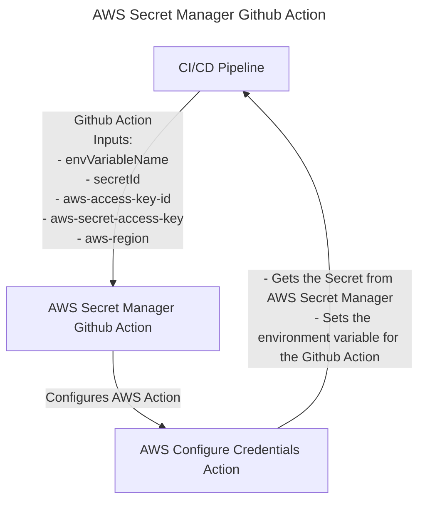

# AWS Secret Manager Github Action

## 👋 Overview
A Github action to get AWS secrets from [Secret Manager](https://aws.amazon.com/secrets-manager/) and output it in the Github action environment. 

## 🚀 Usage

### Inputs

| Name                | Description                                                       | Required |
| ------------------- | ----------------------------------------------------------------- | -------- |
| `envVariableName`   | Name of the environment variable to access within the Github action runner (e.g., DATABASE_URL)       | true     |
| `secretId`          | The identifier for the secret within AWS Secret Manager (e.g., staging_database_url)                 | true     |
| `aws-access-key-id` | AWS access key for [aws-action](https://github.com/aws-actions/configure-aws-credentials)          | true     |
| `aws-secret-access-key` | AWS secret access key for [aws-action](https://github.com/aws-actions/configure-aws-credentials)    | true     |
| `aws-region`        | The AWS region to configure for [aws-action](https://github.com/aws-actions/configure-aws-credentials) | true     |

### Flow



### Sample CI/CD Pipeline Using AWS Secret Manager Github Action

```yaml
name: CI/CD Pipeline

on:
  push:
    branches:
      - staging
jobs:
  deploy_staging:
    name: Deploy to Staging
    runs-on: ubuntu-latest
    steps:
        - name: Checkout Code
            uses: actions/checkout@v2
        - name: Get AWS Secrets
            uses: sachasmart/aws-secret-manager-github-action@v0.0.1
            with:
              envVariableName: DATABASE_URL
              secretId: staging_database_url
              aws-access-key-id: ${{ secrets.AWS_ACCESS_KEY_ID }}
              aws-secret-access-key: ${{ secrets.AWS_SECRET_ACCESS_KEY }}
              aws-region: us-east-1
```
